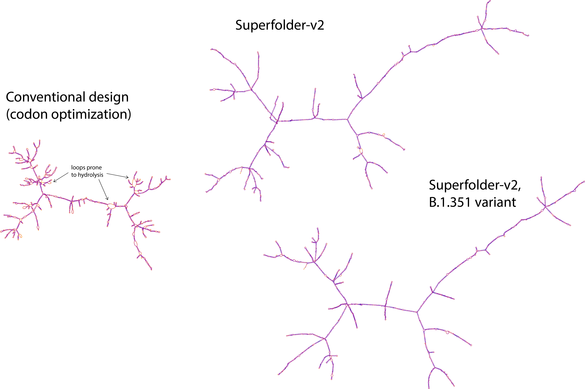

# SuperFolder COVID-19 mRNA vaccine
An mRNA for the SARS-CoV-2 Spike glycoprotein antigen (the prefusion stabilized variant, S-2P), stabilized against hydrolysis, for testing in COVID-19 mRNA vaccines. 

The codons of this *Superfolder S-2P mRNA* have been redesigned to produce a highly stable mRNA structure predicted to have ~3x longer lifetime. The sequence based on computational design rules, algorithms, and a large corpus of experimental data developed in the **OpenVaccine** project, based at Stanford University.

This **open source mRNA vaccine** is being made available in the public domain. For avoidance of doubt, an [Open Covid License](LICENSE) is enclosed with this repository that grants license to any party for use of this sequence and enclosed data in research or product development that could accelerate the end of the COVID-19 pandemic. 

## The RNA sequence
```
> OpenVaccine Superfolder S-2P mRNA
AUGUUUGUGUUUCUUGUCCUCCUUCCACUGGUUUCGAGUCAGUGCGUCAAUCUUACAACACGAACCCAGCUGCCGCCAGCCUACACGAACUCCUUCACGCGGGGAGUGUACUACCCCGACAAGGUGUUCCGCUCGUCUGUUCUGCACAGCACGCAGGACCUCUUCCUCCCGUUCUUCUCGAACGUGACGUGGUUCCAUGCCAUUCACGUUUCGGGAACGAACGGGACGAAGAGGUUCGAUAACCCUGUUCUACCGUUUAACGACGGGGUGUACUUCGCUUCGACAGAGAAGUCCAACAUUAUUCGCGGAUGGAUAUUCGGAACCACUCUCGAUUCCAAGACUCAGUCCUUGUUGAUAGUGAACAACGCCACGAACGUGGUCAUUAAGGUCUGUGAGUUUCAGUUCUGUAAUGACCCGUUCUUGGGUGUUUACUAUCACAAGAACAACAAGUCUUGGAUGGAGAGUGAGUUCCGAGUGUAUUCAUCCGCGAAUAAUUGUACCUUCGAGUAUGUCAGUCAGCCGUUUCUGAUGGAUCUUGAAGGCAAACAGGGCAAUUUCAAGAAUUUGCGCGAGUUUGUCUUCAAGAACAUCGACGGCUACUUCAAGAUAUACUCGAAGCACACGCCAAUCAACCUCGUCCGUGAUCUCCCGCAGGGCUUCAGCGCUCUGGAACCGCUGGUGGACUUGCCGAUAGGCAUCAACAUCACGCGGUUCCAGACGCUGUUAGCCCUGCACAGGAGUUACCUGACCCCAGGUGACUCCUCGUCCGGUUGGACUGCAGGUGCCGCCGCGUACUACGUGGGGUACCUGCAGCCCCGGACGUUCUUGUUGAAGUACAACGAGAACGGGACGAUCACGGACGCGGUUGAUUGUGCGUUGGACCCUCUGUCGGAGACGAAGUGCACCCUGAAGUCGUUUACGGUAGAAAAGGGGAUCUAUCAGACCUCCAACUUCCGCGUCCAGCCGACUGAGAGUAUCGUUCGGUUUCCGAACAUCACGAACCUGUGUCCGUUUGGAGAGGUCUUCAACGCGACCAGGUUCGCCUCCGUGUACGCUUGGAACAGGAAGAGGAUAUCGAAUUGUGUAGCAGACUACAGUGUGCUAUACAAUUCGGCGUCCUUUUCCACUUUCAAGUGUUACGGAGUGUCGCCCACGAAGUUGAACGACCUCUGCUUCACCAACGUGUACGCGGAUUCCUUCGUCAUCCGUGGUGACGAGGUUCGGCAGAUCGCGCCCGGACAGACUGGAAAGAUAGCGGACUACAAUUAUAAGUUGCCCGACGACUUUACUGGCUGCGUUAUUGCUUGGAAUAGCAAUAACUUAGACAGUAAAGUCGGGGGCAACUAUAAUUACCUGUAUCGACUGUUUCGGAAAAGCAAUCUGAAGCCCUUCGAGCGCGACAUUAGCACGGAGAUCUACCAGGCUGGUAGUACUCCGUGCAAUGGCGUGGAGGGCUUCAAUUGCUAUUUUCCGUUACAGUCGUACGGGUUUCAGCCCACCAACGGGGUAGGGUACCAGCCCUACCGCGUGGUGGUGCUGUCGUUCGAACUCCUUCACGCACCCGCGACUGUCUGUGGGCCCAAGAAGUCGACGAACUUGGUGAAGAACAAGUGCGUCAACUUCAACUUCAAUGGGCUCACAGGCACGGGGGUGCUGACGGAGUCGAACAAAAAGUUCCUACCUUUCCAGCAGUUCGGGCGCGAUAUUGCCGACACCACGGAUGCCGUAAGGGAUCCGCAGACGCUUGAGAUUCUGGACAUCACGCCCUGCAGCUUCGGGGGCGUCAGUGUAAUCACGCCUGGUACCAACACGAGCAACCAGGUUGCCGUGUUGUACCAGGACGUGAAUUGCACUGAGGUCCCCGUAGCGAUCCACGCGGAUCAGCUAACCCCAACGUGGAGGGUGUACUCGACAGGGAGUAAUGUCUUCCAGACUCGCGCUGGUUGUCUGAUUGGCGCUGAGCAUGUGAACAACUCGUACGAGUGUGACAUCCCCAUUGGAGCGGGGAUCUGCGCGUCGUACCAGACCCAGACGAACAGCCCGAGGCGUGCCCGCUCAGUAGCGUCGCAGUCGAUCAUCGCGUACACGAUGAGCUUGGGGGCGGAGAACAGUGUAGCCUAUUCGAACAACAGCAUUGCUAUCCCCACAAAUUUUACAAUUAGUGUAACCACCGAGAUCUUACCGGUCUCCAUGACCAAGACCUCGGUGGAUUGCACUAUGUAUAUUUGUGGGGAUAGCACUGAGUGUUCUAACCUCCUGCUCCAGUACGGCAGUUUCUGUACGCAGCUCAACCGAGCGCUUACAGGAAUUGCCGUGGAGCAGGACAAGAACACUCAGGAGGUGUUUGCCCAGGUCAAGCAGAUCUACAAGACACCUCCGAUCAAGGACUUUGGCGGCUUCAACUUCUCCCAGAUACUCCCCGACCCCAGCAAGCCCAGCAAGCGUAGCUUUAUUGAAGAUCUGCUCUUCAAUAAAGUUACGCUUGCUGAUGCUGGGUUCAUCAAGCAGUACGGGGAUUGUCUGGGAGAUAUAGCCGCCAGAGACUUGAUCUGUGCUCAGAAGUUCAAUGGGCUCACUGUUCUCCCCCCCUUGCUCACGGACGAGAUGAUCGCCCAGUAUACUUCGGCGCUGCUGGCGGGCACGAUCACCUCGGGCUGGACGUUUGGGGCUGGUGCGGCGCUGCAGAUCCCCUUCGCCAUGCAGAUGGCGUACCGCUUCAAUGGGAUCGGUGUCACACAGAACGUUUUGUACGAGAAUCAGAAGCUCAUCGCCAAUCAGUUCAACAGCGCGAUCGGGAAGAUACAGGACUCCCUGUCGAGUACAGCCUCCGCGUUGGGGAAGCUGCAGGACGUGGUGAACCAGAAUGCUCAAGCGUUGAACACGUUGGUGAAGCAGUUGUCGUCCAACUUCGGGGCGAUAAGUUCGGUGCUGAACGAUAUUCUCAGUCGGCUGGACAAGGUGGAAGCGGAGGUCCAGAUAGAUCGGCUCAUCACUGGUCGCCUCCAGAGUUUGCAGACGUACGUAACUCAGCAGCUCAUCCGAGCUGCUGAGAUACGUGCGUCUGCAAACCUGGCGGCGACCAAGAUGAGCGAGUGCGUGCUGGGGCAGAGCAAGCGAGUGGACUUCUGCGGGAAGGGCUAUCACCUGAUGUCCUUCCCGCAGAGCGCACCUCACGGGGUAGUCUUUCUCCACGUGACAUAUGUGCCGGCGCAGGAGAAGAACUUCACCACUGCGCCGGCCAUAUGUCACGAUGGGAAAGCCCACUUCCCGCGUGAAGGAGUUUUUGUAUCAAACGGGACGCAUUGGUUCGUCACGCAGCGCAACUUCUAUGAGCCACAGAUAAUUACCACUGACAAUACCUUUGUCAGUGGUAAUUGUGAUGUGGUCAUAGGGAUCGUGAACAACACGGUCUACGAUCCCCUGCAGCCCGAGCUAGAUAGUUUCAAGGAGGAGCUUGAUAAGUACUUCAAGAAUCAUACUUCCCCAGACGUGGAUCUUGGCGACAUUAGCGGCAUCAACGCUAGUGUCGUCAACAUCCAGAAGGAGAUCGACAGGCUCAAUGAGGUUGCCAAGAACCUCAACGAGAGCCUGAUCGAUCUCCAGGAGCUGGGGAAGUAUGAGCAGUACAUCAAGUGGCCUUGGUACAUCUGGCUCGGGUUCAUUGCAGGGUUGAUCGCGAUCGUGAUGGUCACGAUCAUGUUGUGCUGCAUGACGAGCUGUUGCUCCUGUUUGAAGGGCUGCUGCAGCUGUGGUUCGUGUUGUAAGUUUGACGAGGAUGACUCGGAGCCAGUGUUGAAGGGGGUCAAGUUACACUACACAUAA
```
The RNA above also includes a stop codon. 
*Feel free to copy/paste this sequence and use directly in your research or product development.* 

Here is a visualization of the secondary structure of the mRNA:


## What it codes for
```
> S-2P SARS-CoV-2 Spike glycoprotein antigen, prefusion stabilized double proline variant. 1273 amino acids.
MFVFLVLLPLVSSQCVNLTTRTQLPPAYTNSFTRGVYYPDKVFRSSVLHSTQDLFLPFFSNVTWFHAIHVSGTNGTKRFDNPVLPFNDGVYFASTEKSNIIRGWIFGTTLDSKTQSLLIVNNATNVVIKVCEFQFCNDPFLGVYYHKNNKSWMESEFRVYSSANNCTFEYVSQPFLMDLEGKQGNFKNLREFVFKNIDGYFKIYSKHTPINLVRDLPQGFSALEPLVDLPIGINITRFQTLLALHRSYLTPGDSSSGWTAGAAAYYVGYLQPRTFLLKYNENGTITDAVDCALDPLSETKCTLKSFTVEKGIYQTSNFRVQPTESIVRFPNITNLCPFGEVFNATRFASVYAWNRKRISNCVADYSVLYNSASFSTFKCYGVSPTKLNDLCFTNVYADSFVIRGDEVRQIAPGQTGKIADYNYKLPDDFTGCVIAWNSNNLDSKVGGNYNYLYRLFRKSNLKPFERDISTEIYQAGSTPCNGVEGFNCYFPLQSYGFQPTNGVGYQPYRVVVLSFELLHAPATVCGPKKSTNLVKNKCVNFNFNGLTGTGVLTESNKKFLPFQQFGRDIADTTDAVRDPQTLEILDITPCSFGGVSVITPGTNTSNQVAVLYQDVNCTEVPVAIHADQLTPTWRVYSTGSNVFQTRAGCLIGAEHVNNSYECDIPIGAGICASYQTQTNSPRRARSVASQSIIAYTMSLGAENSVAYSNNSIAIPTNFTISVTTEILPVSMTKTSVDCTMYICGDSTECSNLLLQYGSFCTQLNRALTGIAVEQDKNTQEVFAQVKQIYKTPPIKDFGGFNFSQILPDPSKPSKRSFIEDLLFNKVTLADAGFIKQYGDCLGDIAARDLICAQKFNGLTVLPPLLTDEMIAQYTSALLAGTITSGWTFGAGAALQIPFAMQMAYRFNGIGVTQNVLYENQKLIANQFNSAIGKIQDSLSSTASALGKLQDVVNQNAQALNTLVKQLSSNFGAISSVLNDILSRLDPPEAEVQIDRLITGRLQSLQTYVTQQLIRAAEIRASANLAATKMSECVLGQSKRVDFCGKGYHLMSFPQSAPHGVVFLHVTYVPAQEKNFTTAPAICHDGKAHFPREGVFVSNGTHWFVTQRNFYEPQIITTDNTFVSGNCDVVIGIVNNTVYDPLQPELDSFKEELDKYFKNHTSPDVDLGDISGINASVVNIQKEIDRLNEVAKNLNESLIDLQELGKYEQYIKWPWYIWLGFIAGLIAIVMVTIMLCCMTSCCSCLKGCCSCGSCCKFDEDDSEPVLKGVKLHYT
```
This exact amino acid sequence is the basis for most mRNA vaccines that are undergoing clinical trials at the time of writing.


## Where it comes from

The sequence was designed through the following steps, which have been validated through extensive experiments on model mRNA's by the Das and Barna labs at Stanford University (OpenVaccine consortium, 2021, in prep).

1. A starting sequence predicted to have highly negative (stable) deltaG was produced with the [LinearDesign algorithm](https://arxiv.org/abs/2004.10177) available at [this server](http://rna.baidu.com) (Zhang et al., 2020).
2. The sequence was further optimized with the [Ribotree-mRNA Monte Carlo Tree Search algorithm](https://www.biorxiv.org/content/10.1101/2020.08.22.262931v1) which is being made available at the [Eterna software site](http://eternagame.org/about/software).
3. The Ribotree-mRNA runs optimized DegScore, a predictor of overall hydrolysis rate trained on a vast data set of empirical measurements acquired during the [Eterna](https://eternagame.org) [roll-your-own sequence challenges](https://eternagame.org/labs/9830365) (OpenVaccine consortium, 2021, in prep). Training and test data are available at [Kaggle](https://www.kaggle.com/c/stanford-covid-vaccine/).
4. Ribotree-mRNA runs were guided by [EternaFold](https://www.biorxiv.org/content/10.1101/2020.05.29.124511v1), currently the most accurate folding engine for predicting RNA structure properties (Wayment-Steele et al., 2020a).
5. Ribotree-mRNA runs also favored opening of the first 14 nts to ensure a good binding site for the eukaryotic ribosome (Wayment-Steele  et al., 2020b).
6. The sequence was screened for robustness of structure and low predicted hydrolysis in the context of numerous combinations of  5' UTR's, 3' UTR's, and poly(A) motifs that are currently in use for COVID-19 mRNA vaccines.

## Comparison to conventionally designed mRNA sequences

| Design |  dG(MFE) (kcal/mol) |   AUP<sup>a</sup> | DegScore<sup>b</sup> |
| ------------ |------------ |--------- | ----  |
|          IDT | -1089.5     | 0.51     |  1427.8 |
|      GeneWiz | -1304.3     | 0.49     |  1263.9 |
|      GC-rich | -1617.2     | 0.42     |  1176.6 |
| LinearDesign | **-2533.3** | **0.20** |   963.4 |
|  Superfolder | -2385.8     | 0.21     |   **943.6** |

<sup>a</sup> (Wayment-Steele et al., 2020b)
<sup>b</sup> (OpenVaccine consortium, 2021, in prep)

Figure of, e.g., dG vs. degscore 2.1, and dG vs. AUP?*

## Additional files.
**Hannah can you fill in -- subdirectory of sequences for same amino acid sequence generated by 'conventional approaches'*


## References

OpenVaccine Consortium (2021), (in preparation).

Zhang, H., Zhang, L., Li, Z., Liu, K., Liu, B., Mathews, D. H., & Huang, L. (2020). LinearDesign: Efficient Algorithms for Optimized mRNA Sequence Design. arXiv preprint arXiv:2004.10177.

Wayment-Steele, H.K., Kim, D.S., Choe, C.A., Nicol, J.J., Wellington-Oguri, R., Sperberg, R.A.P., Huang, P., Eterna Participants, Das, R. (2020). Theoretical basis for stabilizing messenger RNA through secondary structure design. bioRxiv, 262931.

Wayment-Steele, H.K., Kladwang, W., Eterna Participants, Das, R. (2020). RNA secondary structure packages ranked and improved by high-throughput experiments. bioRxiv, 124511.

**Hannah can you fill in? Eternafold, theoretical basis, lineardesign, other papers as 'in prep'**

For answers to any additional questions that might help accelerate the end of the COVID-19 pandemic, please contact [Rhiju Das](https://daslab.stanford.edu), Stanford University, <a href="mailto:rhiju@stanford.edu">rhiju@stanford.edu</a>.
