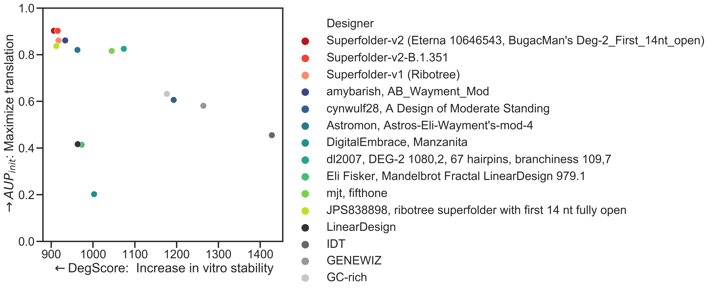
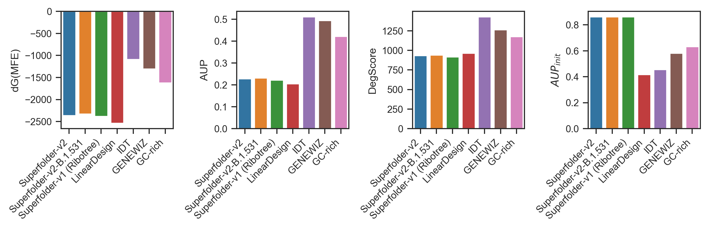

## Comparing the Superfolder to conventionally designed mRNA sequences

| Design |  CAI | dG(MFE) (kcal/mol) |   AUPCDSa | DegScoreb | AUPinit. 14 ntsc |
| ------------ |--------|------- |--------- | ----  | ----  | 
|  Superfolder-v2 | 0.72 |  -2375.4  |  0.22 | **906.4**  | 0.90 |
|  Superfolder-v2-B.1.351 | 0.72 | -2329.1  | 0.23   | 915.6 | 0.90 |
|  Superfolder-v1 | 0.73 | -2382.1     | 0.22     |   917.4 | 0.86 |
| Putative Moderna mRNA-1273K | | | | | |
| Putative BioNTech/Pfizer_BNT-162b2K | | | | | |
| LinearDesigne | 0.73 | -2533.3 | 0.20 |   963.4 | 0.42 |
|      GC-richd | 0.80 | -1617.2     | 0.42     |  1176.6 | 0.63 |
|     [GENEWIZ](https://www.genewiz.com/Public/Services/Gene-Synthesis/Codon-Optimization) codon optimization | 0.95 | -1304.3     | 0.49     |  1263.9 | 0.58 |
|          [IDT](https://www.idtdna.com/pages/tools/codon-optimization-tool?returnurl=%2FCodonOpt) codon optimization | 0.73 | -1089.5     | 0.51     |  1427.8 | 0.46 |
  
aAverage unpaired probability over entire coding sequence (Wayment-Steele, 2020b).  
bMachine-learning model for predicting degradation more accurately than average unpaired probability (OpenVaccine consortium, 2021, in prep).  
cAverage unpaired probability of the first 14 nucleotides of the coding sequence (Kozak, 1990; OpenVaccine consortium, 2021, in prep) -- should be *high* to optimize translation.  
dEach codon is randomly sampled from the most GC-rich codons for that amino acid (Thess, 2015).  
eZhang, 2020.

The Superfolder construct was optimized by Eterna participants to reduce predicted degradation. It is an adaptation of Superfolder-v1, which had been optimized in RiboTree both to minimize DegScore, maximizing in vitro stability, while keeping the first 14 nucleotides of the coding sequence unpaired.

The Superfolder-B.1.351 construct was developed by enumerating all GC-rich codon substitutions to result in the B.1.351 mutant spike protein, evaluating their DegScore, and selecting the variant with the lowest DegScore.

## Additional mRNA designs

Eterna participants designed S-2P mRNAs with a diversity of structures in OpenVaccine project. 181 constructs were submitted and voted upon by Eterna participants. The top 9 candidates are included in this repository.

`sequences/Eterna_S2P_mRNAs.fasta` contains the winning S-2P sequences from Eterna OpenVaccine.

`sequences/more_ribotree_mRNAs.fasta` contains more solutions generated by RiboTree with similar low DegScore values.

## Reproduce analysis and algorithmic design

`sequences/conventional_mRNAs.fasta` contains the sequences generated above to compare to the Superfolder sequence and statistics.

`analysis/analysis.py` reproduces the above calculations, with an example input in `assets/example_input.csv`.

`analysis/example_ribotree_input` contains representative input files used in Ribotree optimization.

`analysis/example_ribotree_output` contains representative output files from Ribotree optimization.

## References

Dae-Eun Jeong, D.E. Matthew McCoy, M., Karen Artiles, K., Orkan Ilbay, O., Fire, A., Nadeau, K., Park, H., Betts, B., Scott Boyd, S., Hoh, R., Shoura, M. [Assemblies of putative SARS-CoV-2 spike encoding mRNA sequences for vaccines BNT-162b2 and mRNA-1273](https://github.com/NAalytics/Assemblies-of-putative-SARS-CoV2-spike-encoding-mRNA-sequences-for-vaccines-BNT-162b2-and-mRNA-1273).

Kozak M. Downstream secondary structure facilitates recognition of initiator codons by eukaryotic ribosomes (1990). Proc Natl Acad Sci U S A. 87(21):8301-5. [doi: 10.1073/pnas.87.21.8301](http://dx.doi.org/10.1073/pnas.87.21.8301)

OpenVaccine Consortium (2021). Comparative optimization of messenger RNA structure, stability and expression for RNA therapeutics (in preparation).

Wayment-Steele, H.K., Kim, D.S., Choe, C.A., Nicol, J.J., Wellington-Oguri, R., Sperberg, R.A.P., Huang, P., Eterna Participants, Das, R. (2020). Theoretical basis for stabilizing messenger RNA through secondary structure design. bioRxiv, 262931.

Wayment-Steele, H.K., Kladwang, W., Eterna Participants, Das, R. (2020). RNA secondary structure packages ranked and improved by high-throughput experiments. bioRxiv, 124511.

Thess, A., Grund, S., Mui, B. L., Hope, M. J., Baumhof, P., Fotin-Mleczek, M., & Schlake, T. (2015). Sequence-engineered mRNA without chemical nucleoside modifications enables an effective protein therapy in large animals. Molecular Therapy, 23(9), 1456-1464.

Zhang, H., Zhang, L., Li, Z., Liu, K., Liu, B., Mathews, D. H., & Huang, L. (2020). LinearDesign: Efficient Algorithms for Optimized mRNA Sequence Design. arXiv preprint arXiv:2004.10177.

For answers to any additional questions that might help accelerate the end of the COVID-19 pandemic, please contact [Rhiju Das](https://daslab.stanford.edu), Stanford University, <a href="mailto:rhiju@stanford.edu">rhiju@stanford.edu</a>.
